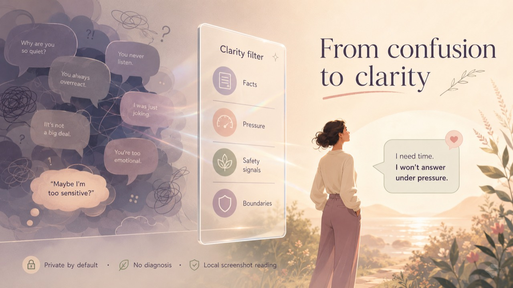

<p align="center">
  <a href="./README.zh-CN.md">简体中文</a> · <strong>English</strong>
</p>

<h1 align="center">Grow Into Yourself</h1>

<p align="center">
  <strong>A privacy-first clarity tool for conversations that leave you guilty, confused, frightened, or smaller than before.</strong>
</p>

<p align="center">
  <a href="https://clear-translate.creamy-scarf-2160.chatgpt.site"><strong>Try the live demo →</strong></a>
</p>

<p align="center">
  
</p>

<p align="center">
  <code>AI-assisted analysis</code> ·
  <code>No sign-up</code> ·
  <code>No diagnosis</code> ·
  <code>English / 中文</code>
</p>

## Why this exists

Some of the hardest conversations do not look dramatic from the outside.

They arrive as a calm “I’m only doing this for you,” a joke that leaves someone ashamed, a manager quietly rewriting what happened, or a family member turning every boundary into proof of disloyalty.

After enough conversations like these, people often stop asking *“Was that fair?”* and start asking *“Am I the problem?”*

That gap matters. Psychological aggression can involve language used to cause emotional harm or exert control. Emotional abuse may appear as isolation, intimidation, humiliation, guilt or denial rather than physical violence. Workplace bullying and harassment are also recognised psychosocial risks—not merely personality clashes.

Grow Into Yourself was built for the moment before someone has the right words: when they have a chat in front of them, a knot in their stomach, and no neutral way to read what just happened.

It does not decide who is good or bad. It helps the user slow the conversation down, examine the actual words, notice pressure, and recover enough clarity to choose what happens next.

## What it does

| Read the conversation                                               | Find the pressure                                                                        | Recover your choices                                      |
| ------------------------------------------------------------------- | ---------------------------------------------------------------------------------------- | --------------------------------------------------------- |
| Separates the other person’s words from the user’s reply            | Flags possible guilt, humiliation, blame-shifting, threats, denial, isolation or control | Suggests soft, firm and exit-style boundary replies       |
| Reviews individual sentences instead of producing a generic summary | Explains why a sentence may hurt and where evidence remains uncertain                    | Surfaces safety concerns only when the text supports them |

The result is designed more like careful margin notes than a chatbot verdict:

* **What happened**
* **Possible pressure signals**
* **Patterns in the user’s own reply**
* **Sentence-by-sentence annotations**
* **A clearer reading of each sentence**
* **Three boundary reply options**
* **Risk level and proportionate safety guidance**

## Product principles

**Behaviour, not labels.**
The tool does not diagnose NPD or any personality disorder. It discusses observable language, repetition, power, boundaries and impact.

**Uncertainty stays visible.**
One sentence cannot define an entire relationship. When the evidence is incomplete, the analysis should say so rather than inventing context.

**Safety without alarmism.**
Urgent guidance is reserved for credible signs such as threats, stalking, forced control, danger to a child, self-harm coercion or harm to others.

**The user keeps agency.**
The output offers interpretations and possible wording. It does not order the user to reconcile, confront, forgive or leave.

## How it works

```text
Other person’s messages ─┐
                         ├─> /api/analyze ─> OpenRouter model ─> structured JSON
My reply or draft ───────┘                         │
                                                  └─> local fallback if unavailable
```

1. The user pastes the other person’s messages into the first box.
2. Their previous reply or draft response can be added separately.
3. The server-side API sends the text to the configured AI model.
4. The model returns structured analysis rather than free-form chat.
5. If the provider is unavailable, the page remains usable through a clearly labelled basic local fallback.

Keeping the speakers in separate fields avoids unreliable speaker guessing and removes slow mobile OCR from the critical path.

## Current test-version decision

Direct screenshot upload is paused.

Mobile OCR created unnecessary waiting, browser memory pressure and speaker-attribution errors. For the current test version, users extract text using their phone, gallery or chat application and paste it into the two fields themselves.

This is less flashy, but more reliable—and reliability matters more here than pretending an uncertain transcript is accurate.

## Technical overview

| Layer         | Implementation                                           |
| ------------- | -------------------------------------------------------- |
| Interface     | Next.js, React, TypeScript                               |
| AI endpoint   | `POST /api/analyze`                                      |
| Model routing | OpenRouter-compatible server request                     |
| Configuration | `OPENROUTER_API_KEY`, `OPENROUTER_MODEL`                 |
| Response      | Structured JSON with sentence analysis and reply options |
| Resilience    | Local fallback instead of a broken page                  |
| Languages     | English and Simplified Chinese                           |
| Safety        | Non-diagnostic prompting and urgent-risk gating          |

The API key belongs only in server-side environment variables. It must never be committed to GitHub or exposed in client-side JavaScript.

```env
OPENROUTER_API_KEY=your_server_side_key
OPENROUTER_MODEL=deepseek/deepseek-chat-v3-0324:free
```

Available free-model identifiers may change. Deployment configuration should therefore remain replaceable rather than hard-coded into the interface.

## Privacy

Text may be sent to a configured AI model to generate the requested analysis.

This site is designed not to save the pasted conversation. Users should still remove names and avoid submitting identity numbers, bank details, exact addresses, private account credentials or other highly sensitive information.

The project is privacy-conscious, but it does not make the inaccurate claim that AI analysis happens entirely on the user’s device.

## What this is not

Grow Into Yourself is not a therapist, emergency service, legal adviser or diagnostic system. It cannot determine a person’s intentions from a short excerpt, and it should not replace qualified local support where immediate safety is involved.

## Evidence behind the problem

The product direction is informed by established definitions and research:

* [WHO — Violence against women](https://www.who.int/news-room/fact-sheets/detail/violence-against-women)
* [CDC — About intimate partner violence](https://www.cdc.gov/intimate-partner-violence/about/index.html)
* [UN Women — Signs of relationship abuse](https://knowledge.unwomen.org/en/articles/faqs/faqs-the-signs-of-relationship-abuse-and-how-to-help)
* [The National Domestic Violence Hotline — Emotional abuse](https://www.thehotline.org/resources/what-is-emotional-abuse/)
* [The National Domestic Violence Hotline — Types of abuse](https://www.thehotline.org/resources/types-of-abuse/)
* [WHO — Mental health at work](https://www.who.int/news-room/fact-sheets/detail/mental-health-at-work)
* [ILO — Experiences of violence and harassment at work](https://www.ilo.org/publications/major-publications/experiences-violence-and-harassment-work-global-first-survey)
* [UNICEF — Violence against children](https://www.unicef.org/protection/violence-against-children)

These sources do not endorse or validate this software. They support the underlying premise that psychological pressure, controlling behaviour, emotional abuse and workplace harassment can be consequential even when no physical injury is visible.

## Status

This is an early public test built to explore a narrow question:

> Can AI help someone read a difficult conversation more clearly without diagnosing strangers, exaggerating danger, or taking away the user’s choices?

Feedback is welcome, especially where the analysis feels vague, overconfident, culturally awkward or unsafe.

---

<p align="center">
  <strong>Understand the behaviour. Keep your choices. Grow into yourself.</strong>
</p>
